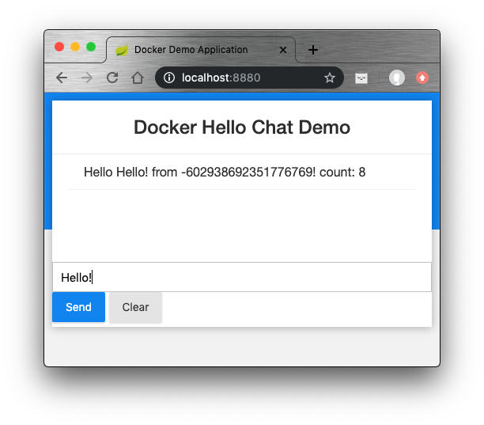

[TOC]

# A STG Docker Certification Module

In this project you will be using Docker to run a full event-driven system, made up of multiple applications on your workstation.  Using the command line and other tools for Docker, you will be creating images, running containers and using the networking and volume capabilities to configure and run that system.

While this certification uses a demonstration application written in Java, the principles can be used to build applications and systems using any language and set of tools.  One of the exciting uses of Docker!

It is highly recommended to read this entire document before proceeding.

## Before You Begin

To complete the certification, you will need to demonstrate your ability to use the tools and understand the fundamentals behind Docker's technology.

To more clearly showcase your Docker skill, you will need to follow the following procedural steps.

1. You will need to create your own fork of this certification repository and clone it to your workstation.
1. Before you work on each step of this certification you will need create a new branch specifically for that step within your forked repository.
1. You will then need to commit and push your work to your repository on Bitbucket on a regular basis while working on this certification. While there is no official time limit on completing this certification we want to see the progress that you have made. This does not mean that you need to make a commit daily, it simply means that any day that you do work on the certification you should make a commit and push that work by the end of the day.
1. After each section is completed you will need to save and push your code AND make a pull/merge request to merge your code to your repository's master branch for each section of your work. You can then merge to master using the pull request.  The pull request and branch should still be visible through the Bitbucket site through the use of "merged" filters.  This process will allow reviewers to clearly see changes made between sections to verify completion.
1. Completion of each section will involve some variation of standard out capture or screen capturing.  See the [Recording](./Recording.md) document on ways to capture the needed information.  In general, it is recommended that you use standard out capture, since the entire output of commands can be captured. 
1. The [certification resources](./Certification.md) provides links to resources to help you understand Docker and how to use the tools provided.  It also provides a guideline of what you should understand when you complete this certification.
1. At the very least, it is highly recommended that you go through and understand the principles in the [Docker Tutorial.](https://docs.docker.com/get-started/)
1. Any questions about the certification can be directed toward the certification reviewer.


## Initializing

This section will step you through the setup and installation process for Docker and have you run and configure an initial container.

1. Fork and clone the [STG Docker Certification](https://bitbucket.org/stgconsulting/dockercertification/) repository.
    1. Click on the `Plus - create` icon, in the left sidebar.
    1. In the `Get to work` section, click the `Fork this repository` menu item.
    1. Select the `Fork Repository` option near the bottom of the menu.
    1. Click on the `Clone` button at the top of the new repository.
    1. Click on the `Copy` icon next to the URL.
    1. Use a git client of your choice to clone the repository.

1. Create a new branch called `initializing` and checkout this branch. This is where you will begin working on this project.

1. Install Docker, Docker Compose and Swarm tools: https://docs.docker.com/install/

1. Start a new container using the `rabbitmq:3-management` image from Docker Hub, with the following settings:

    1. Name the container `hello-broker`.    
    1. Make the server available on port `5672` of the host machine.
    1. Make the management server (port of `15672`) available on port  `8888` of the host machine.
    1. Change the default username to `admin` and default password to `dockerRul3z!` using the `RABBITMQ_DEFAULT_USER` and `RABBITMQ_DEFAULT_PASS` environment variables.

1. Document the running container (output of `docker ps` or similar).  Capture this to a file named `initializing.<out|txt|png>`.  Commit this file.
1. Document the running of the management server by capturing the main admin screen (after login) with either a screen capture or an html file.  Capture this to a file named `initializing-management.<html|png>` and commit the file.     
1. Save your work and push these changes to Bitbucket and create a Merge Request to merge them to `master`.

### Core Concepts

After completing this section, you should be able to show your competency in the following area(s):

1. Know how to install and run the Docker daemon.
1. Use the Docker CLI to run a container.
1. Use the Docker CLI to view the status of the running containers.  

## Builder

Creating a `Dockerfile` and using it to create an image is a core skill.  Containerizing an application, however, doesn't always only include
 the one file, but involves using the product of some kind of build process.  
 
Using Docker containers as part of the build process can save a lot of time and setup, as well as reduce the size of the produced images.  If done right, the tools needed to build the application don't even need to be installed.

In this section, you will flex your DevOps skills and use multiple `Dockerfiles` and the multi-stage build capabilities of Docker to build three applications that will eventually utilize the
message broker you setup in the `initializing` phase.

1. Create a new branch called `builder` and checkout this branch.
1. In each of the three directories, `hello-producer`, `hello-responder` and `hello-counter`, create a Dockerfile that will build the project as well as create an image for each of the three applications.

    1. Use the `maven:3-jdk-13` container to build the applications.
    1. The command to build each project is `mvn clean package`.
    1. The `<workdir>/target/hello-<producer|responder|counter>-0.0.1.jar` is needed in the final image.
        1. It may be easiest to use a command like `COPY --from=BUILD target/*.jar app.jar` as a generic way to copy the file to a usable location in the new container.
    1. Use this command to run the applications within the containers: `java -Djava.security.egd=file:/dev/./urandom -jar /app.jar`

1. Use Docker to build the three applications and capture the output in a file called `builder.<out|txt|png>`. 
1. Save your work and push these changes to Bitbucket and create a Merge Request to merge them to `master`.

### Core Concepts

After completing this section, you should be able to show your competency in the following area(s):

1. Use Docker to create images Create a `Dockerfile` to run an application inside a container.
1. Use the multistage capabilities of Docker to build an application and assemble a Docker image without installing build-specific tools.
1. Use the Docker CLI to build and tag a Docker image.

## Builder Cache

If you were paying attention, the build process created in the last section took a long time.  Tools like Maven, including NPM, pip, NuGet, Gradle and others, download needed dependencies for applications.  This can sometimes be a lengthy process.  

Building multiple applications at once can just make it worse, since the dependencies for each application will be downloaded, even if they share many of the same ones.

In this section, you'll try to speed that up with a couple of techniques using either an intermediate build container as a "stage" of the build, or a "builder" image.  You'll use both techniques here.

1. Create a new branch called `builder-cache` and checkout this branch.
1. Create a `Dockerfile` in the `builder-cache` directory.
1. Use the `maven:3-jdk-13` container just like the others.
1. Use the command `mvn dependency:go-offline` in the `Dockerfile`.
1. Build and tag the image as `builder-cache:latest`.

### Stage Container

1. Change the `hello-producer/Dockerfile`, created in the last section to use the `/root/.m2/repository` directory as part of the build using the ```--FROM``` syntax.  Copy the directory to the same location in the multistage build.
    1. Tag the image as `hello-producer:latest`.  
1. Use Docker to build the application and capture the output in a file called `builder-stage.<out|txt|png>`. 

### Builder Container

1. Change the `hello-responder/Dockerfile`, created in the last section, to extend the `builder-cache:latest` image.
    1. Tag the image as `hello-responder:latest`.   
1. Use Docker to build the application and capture the output in a file called `builder-extend.<out|txt|png>`.

### Completion
1. Use one of the techniques on the `hello-counter` application, either using the "stage" or "builder" pattern.  Build the `hello-counter` application and capture the output in a file `builder-counter.<out|text|png>`.
    1. Tag the image as `hello-counter:latest`.
1. There should now be 3 files: `builder-stage.<out|txt|png>`, `builder-extend.<out|txt|png>`, `builder-counter.<out|text|png>`. 
1. Save your work and push these changes to Bitbucket and create a Merge Request to merge them to `master`.

### Core Concepts

After completing this section, you should be able to show your competency in the following area(s):

1. Use two techniques utilizing the multistage capabilities of Docker to speed up the build of applications with large dependencies.

## Running

So far, you've used Docker for running a single container, as well as  building images for multiple applications.  

In this section we'll put it all together to run a full system, right on your workstation.

1. Create a new branch called `running` and checkout this branch.
1. Create a network called `hello-network`.  This network will be used for all of the containers.
    1. _NOTE:_ This will require a recreation of the `hello-broker` RabbitMQ container created in the `initializing` section inorder to connect it to the new network.
1. The `hello-counter` application requires a MySQL server to be running.  
    1. Start a new container using the `mysql:8` image.  Call it `hello-counter-datastore`.
    1. Create and use a volume called `hello-counter-data` and mount it to the `/var/lib/mysql` directory of the new container.
    1. Use the `MYSQL_DATABSE` environment variable with a value of `hello_counter` to create the initial database within the new container.
    1. Use the `MYSQL_ROOT_PASSWORD` environment variable to set the root password to `d0ckerC3rt!` (the same as found in the `hello-counter/src/main/resources/application.properties` file). 
    1. Expose the container's `3306` port.
1. Run each of the applications built in the previous section:
    1. `hello-producer`
        1. Use the `hello-producer:latest` image.
        1. Name the container `hello-producer`.
        1. Map port `8080` to port `8880` on the host machine.
        1. Connect it to the `hello-network`.
    1. `hello-counter`
        1. Use the `hello-counter:latest` image.
        1. Name the container `hello-counter`.
        1. Connect it to the `hello-network`.
    1. `hello-responder`
        1. Use the `hello-responder:latest` image.
        1. Name the container `hello-responder`.
        1. Connect it to the `hello-network`.
1. After allowing the servers to start, open a browser to `http://localhost:8880`.  You should see a page that looks similar to  
1. Capture the output of the `docker container ls` (or `docker ps`) command and save it to a file called `running.<out|txt|png>`.
1. Save your work and push these changes to Bitbucket and create a Merge Request to merge them to `master`.

### Core Concepts

After completing this section, you should be able to show your competency in the following area(s):

1. Working knowledge of Docker CLI to accomplish the running of multiple containers from multiple images to stand-up a working system.

## Compose

All the previous steps required individual commands.  In this section we'll use **Docker Compose** to combine all of those commands and introduce the concept of a "stack".

1. Create a new branch called `compose` and checkout this branch.
1. Create a new file called `docker-compose.yml`.
1. Use Docker Compose file version "3.7" or above.
1. As part of the compose file, create the following:
    1. networks:
        1. `hello-network`
    1. volumes:
        1. `hello-counter-data` - Used for the counter MySQL database
        1. `hello-broker-data` - Used for the broker server data
        1. These volumes should be named.
    1. services:
        1. `hello-producer`
            1. Use the `hello-producer` directory for the build context.
            1. Map the container's port `8080` to the host machine's port `8880`
            1. Container should start after the `hello-responder` and `hello-broker` services.
        1. `hello-responder`
            1. Use the `hello-responder` directory for the build context
            1. Contaier should start after the `hello-broker`  and `hello-counter` services.
        1. `hello-counter`
            1. Use the `hello-counter` directory for the build context
            1. Container should start after the `hello-counter-datastore` and `hello-broker` services.
        1. `hello-counter-datastore`
            1. Use the `mysql:8` image
            1. Use the `hello-counter-data` volume and map it to the `/var/lib/mysql` directory in the container.
            1. Use the `MYSQL_DATABASE` environment variable with a value of `hello_counter` to create the initial database within the new container.
            1. Use the `MYSQL_ROOT_PASSWORD` environment variable to set the root password to `d0ckerC3rt!` (the same as found in the `hello-counter/src/main/resources/application.properties` file). 
            1. Expose the container's `3306` port.  This should be available to other applications on the network, but *NOT* on the host.
        1. `hello-broker`
            1. Make port `5672` available to the applications within the `hello-network`, but *NOT* available on the host.
            1. Map port `15672` to the host port `8888`.
            1. Use the `hello-broker-data` volume and map it to the container's `/var/lib/rabbitmq` directory.
            1. Change the default username to `admin` and default password to `dockerRul3z!` using the `RABBITMQ_DEFAULT_USER` and `RABBITMQ_DEFAULT_PASS` environment variables.
1. You can check that the system is configured correctly by running a `docker-compose up -d` command.  The following should work:
    1. The page at [http://localhost:15672] should bring up the RabbitMQ admin screen.
    1. The page at [http://localhost:8880] should be accessible.
        1. Typing something in the input field and clicking the `Send` button should receive an immediate reply.
1. To ensure the completion of this stage, the `docker-compose.yml` file will be used to build, start, view logs, shutdown and restart the `hello` system, using the standard Docker Compose commands.  It is expected that starting the entire system (i.e. all services, volumes, networks, etc.) can be started with a single `docker-compose up` command.  
1. Save your work and push these changes to Bitbucket and create a Merge Request to merge them to `master`.

### Core Concepts

After completing this section, you should be able to show your competency in the following area(s):

1. Working knowledge of `docker-compose.yml` file syntax to accomplish the declaration of multiple services.
1. Working knowledge of Docker Compose CLI to start and stop (via `down`, this step not required to show, but you **should** be familiar with it!). 

## Swarm

Docker Compose is a great tool to get a system running.  However, it only lets you run a single instance of any of the containers.

Docker Swarm is a container orchestration tool that allows a "stack" to be managed and allow the starting and stopping of multiple containers from the same image, among other things.

1. Create a new branch called `swarm` and checkout this branch.
1. Modify the `docker-compose.yml` file to start 3 containers from the `hello-responder` image.
1. Capture the output of the `docker container ls` (or `docker ps`) command and save it to a file called `swarm.<out|txt|png>`.
1. It is recommended (but not **required**) that you play around with increasing and decreasing the number of containers and see how it affects the output in the `hello-producer` application.
1. Save your work and push these changes to Bitbucket and create a Merge Request to merge them to `master`.

### Core Concepts

After completing this section, you should be able to show your competency in the following area(s):

1. Working knowledge of `docker-compose.yml` file syntax to declare stack level settings to start multiple instances of a service.
1. Familiarity with Docker Swarm and the concept of container orchestration.

# **Congratulations**
You have completed the Docker Certification!

To ensure completeness, the following files should be located within the repository:

1. `initializing.<out|txt|png>`
1. `initializing-management.<html|png>`
1. `builder.<out|txt|png>`
1. `builder-stage.<out|txt|png>`
1. `builder-extend.<out|txt|png>`
1. `builder-counter.<out|text|png>`
1. `hello-counter/Dockerfile`
1. `hello-producer/Dockerfile`
1. `hello-responder/Dockerfile`
1. `builder-cache/Dockerfile`
1. `docker-compose.yml`
1. `running.<out|txt|png>`
1. `swarm.<out|txt|png>`

Next steps:

1. Notify your certification coordinator that you have completed the certification.
1. Ensure the Bitbucket repo is available to your certification coordinator.